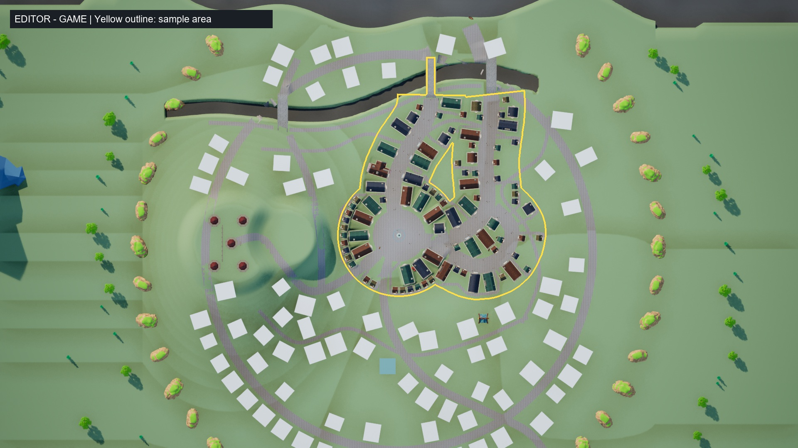
编辑器 -game 实景，黄线为样板区；89 栋 City 建筑，20 种外观组合、4 种体形，屋顶覆盖率 41.20%。样板外保留白模，不是最终全城。

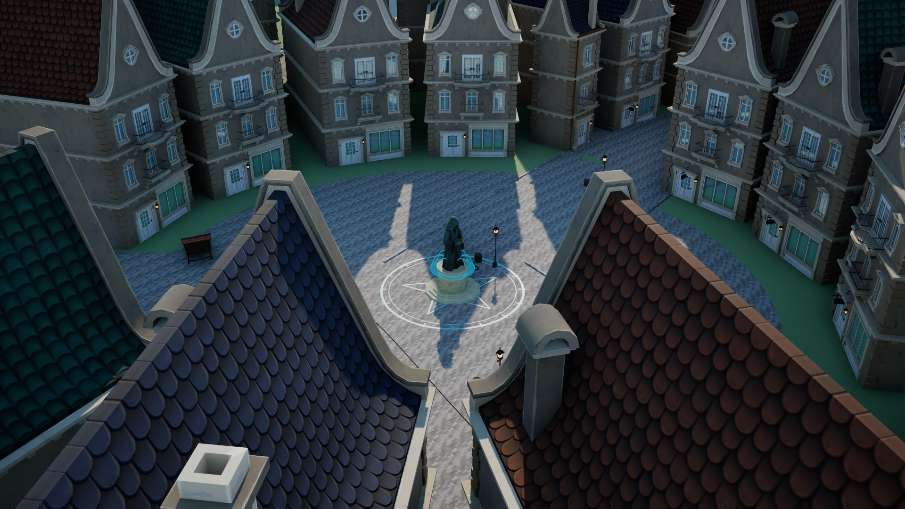
V01 午后，中央喷泉与淡光魔法阵；机位只向上调整 5 m，前景屋顶仍占较大比例。

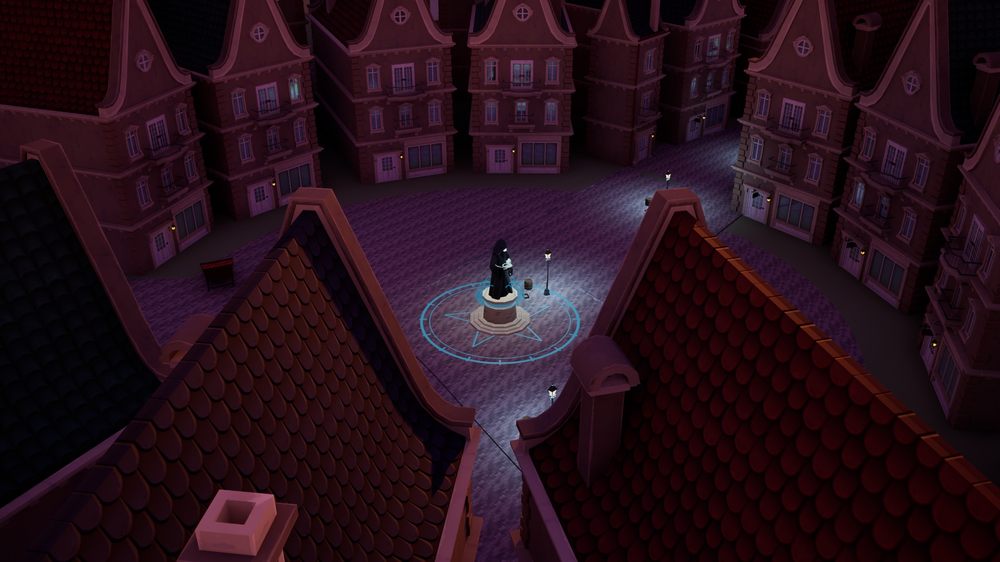
同机位黄昏，偏红紫的环境光与蓝色灯光，观感待审阅。

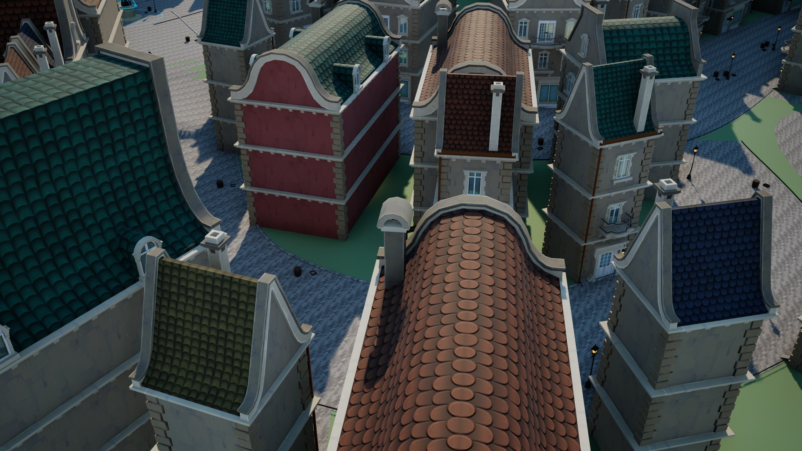
V02 午后，市场与酒馆街。屋顶有红、蓝、灰绿、赭黄变化；近景屋顶仍有遮挡。

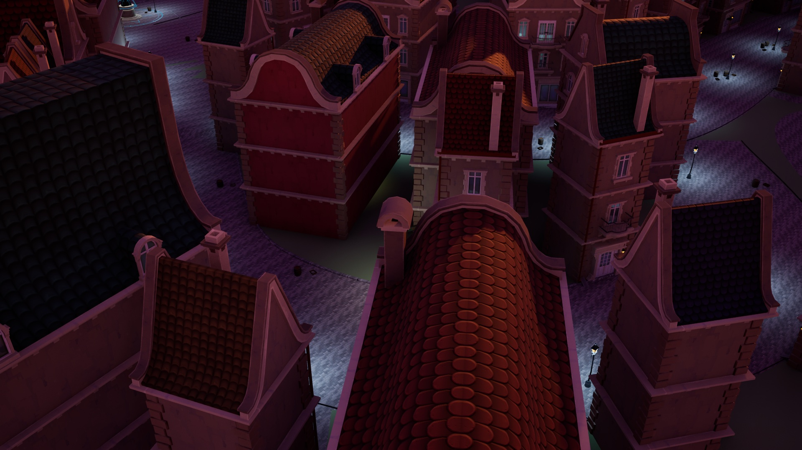
V02 同机位黄昏，街灯亮起；未改变曝光补偿。

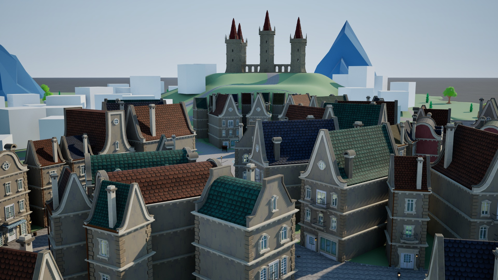
V10 午后，街区后的城堡轮廓采用 Castle 塔段和塔顶，不再是城堡白模体块。

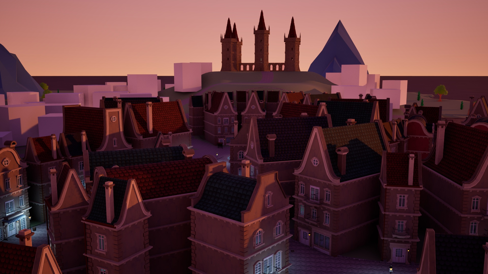
V10 同机位黄昏；样板之外的其他地区仍待扩建。

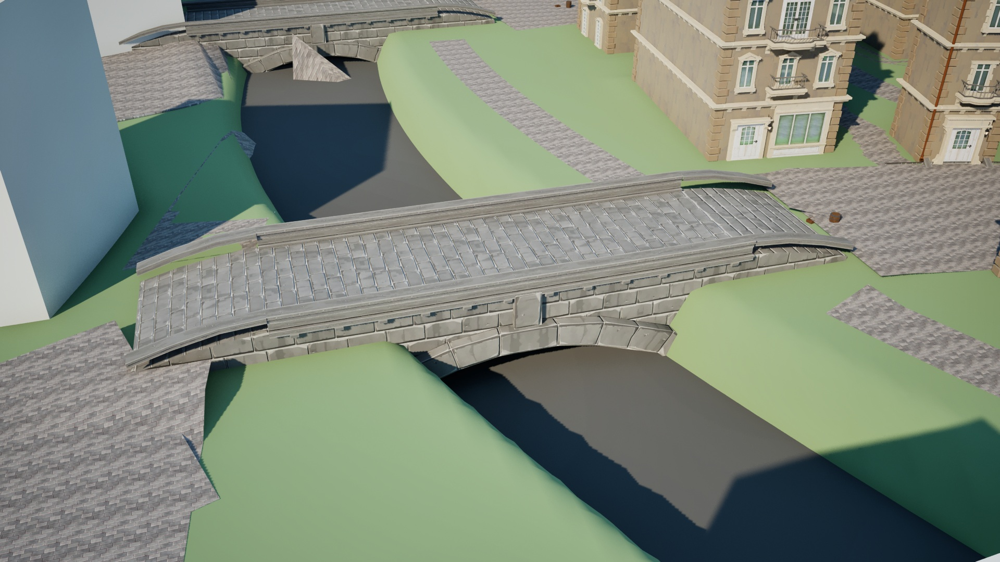
新增桥视点午后，City 石桥连接样板街道；原 V04 被新增屋顶遮挡，仍在十二固定视点对照中保留。

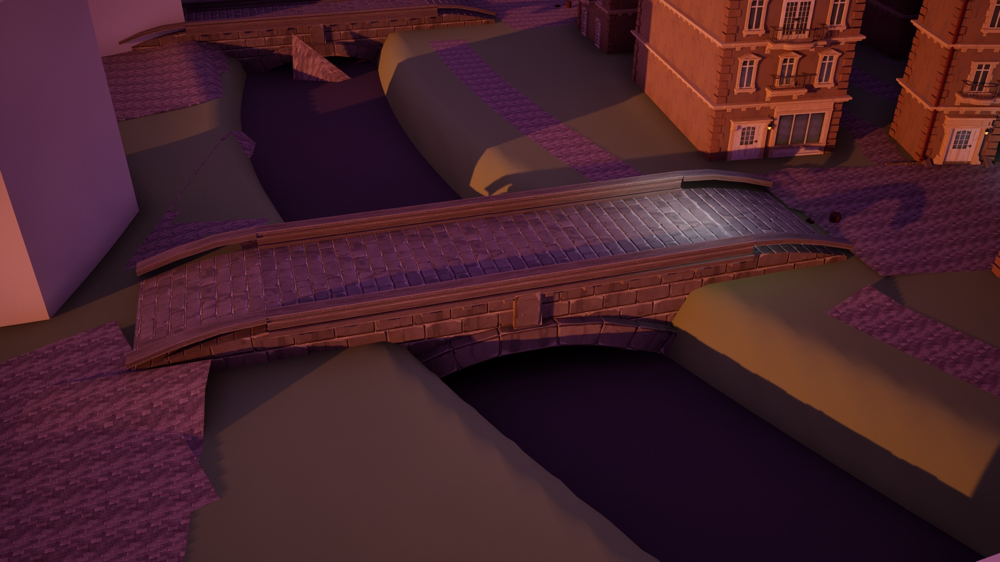
新增桥视点同机位黄昏，桥头栏杆和岸边细节仍可继续精修。

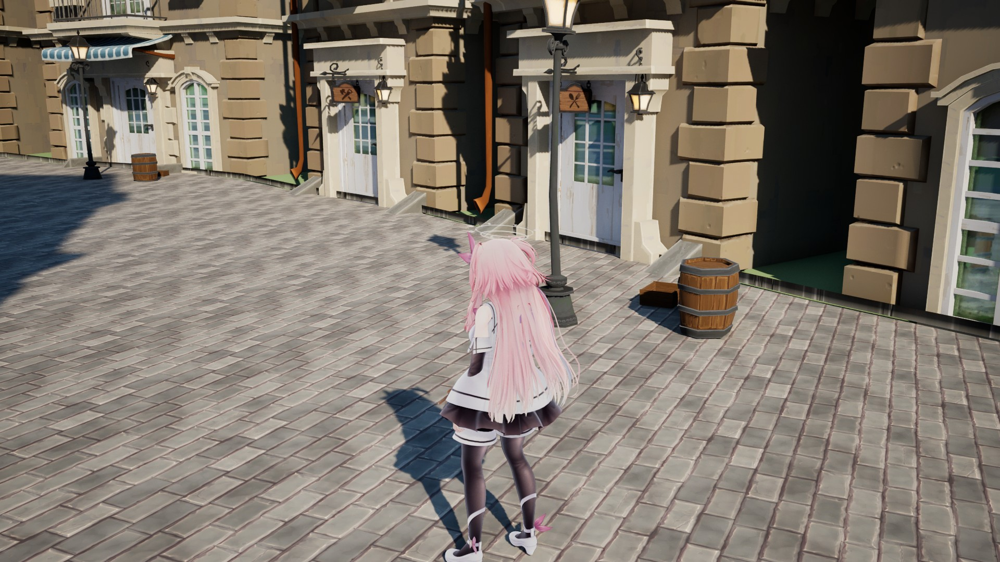
主角侧后 45 度、距离 4 m，市场街景午后；主角比例、材质未改。

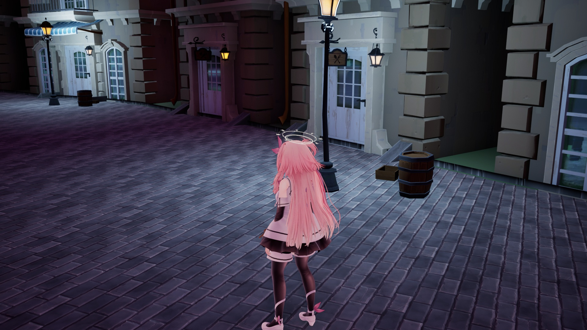
相同主角视点黄昏，展示近景门窗、灯具、招牌与铺石。

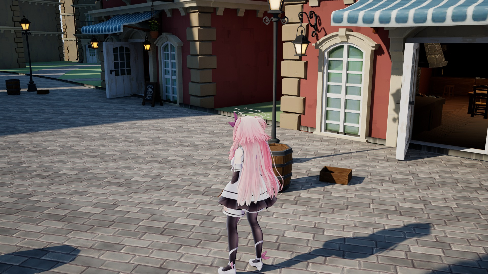
通往石桥的街景午后，可见打开的门和室内暖光；全套室内可玩性尚未验收。

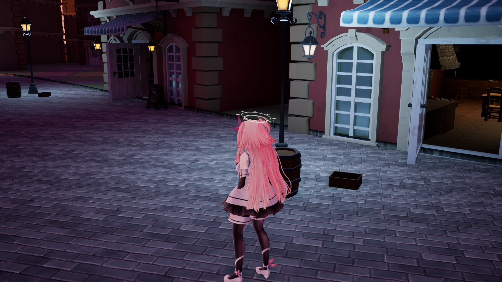
通桥街相同视点黄昏；样板美术等待用户确认后再扩展到全城。

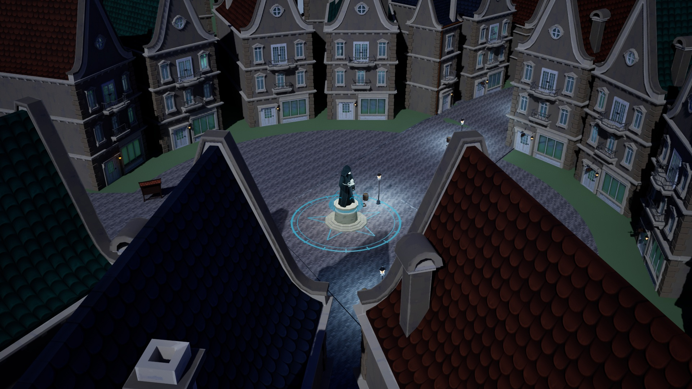
广场夜景，喷泉、魔法阵及立面灯光；不是最终独立包截图。

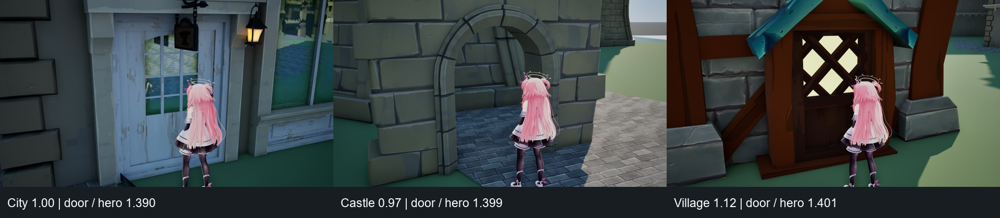
City / Castle / Village 建筑缩放为 1.00 / 0.97 / 1.12，门高约为主角的 1.390 / 1.399 / 1.401 倍。三张均为站稳后的编辑器实景，未改变主角尺寸。
